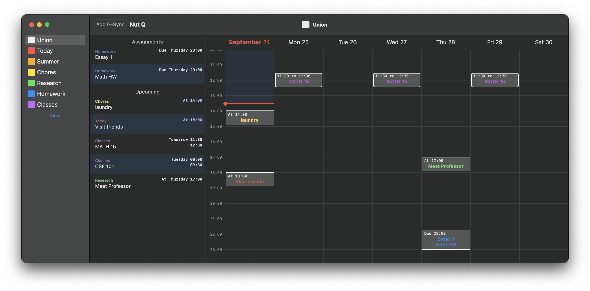
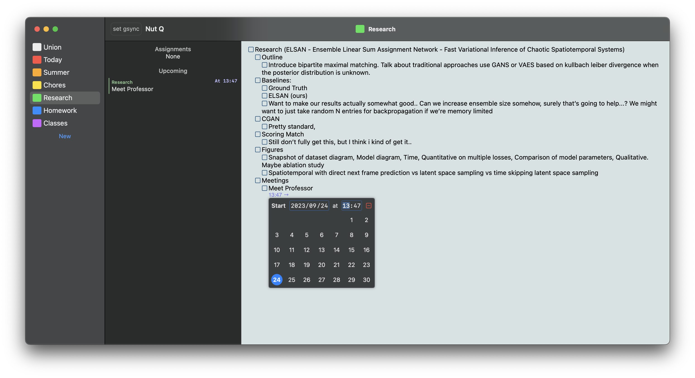

#  Nutq Darwin

- Idea is to divide different task lists by "scheme", with the calendar showing the tasks that are in the union of all the different schemes. Uses a master slave token passing approach so only one online device can write at a single time. Also supports syncing a single scheme to google, repeating events, remind later from the 
- a task can have a start, an end, both, or neither
    - both start and end is considered an event
    - just end is considered an assignment
    - just start is considered a reminder
    - none is considered a procedure (no calendar item, but still may be used for planning purposes)
## Union View

## Scheme Editor

majority is a mess...
## Known Bugs
- macOS
    - command s + command z should probably close the start menu.
        - undo/redo is pretty bad in general
    - because i attribute based on line indices instead of start/end/repeat (which was hard to get to work), copy paste doesn't work on eventful lines (neither tabs nor events are copied over)
        - related: copy pasting sometimes doesn't make sense in that the first line may still have old start, tedious to work around
    - focus state acquisition is terrible, switching out and in of textview causes delay
- iOS
    - strikethrough doesn't go away when it should
    - text wrapping isnt ideal

- general
    - multi line highlights can be behind times or buttons
